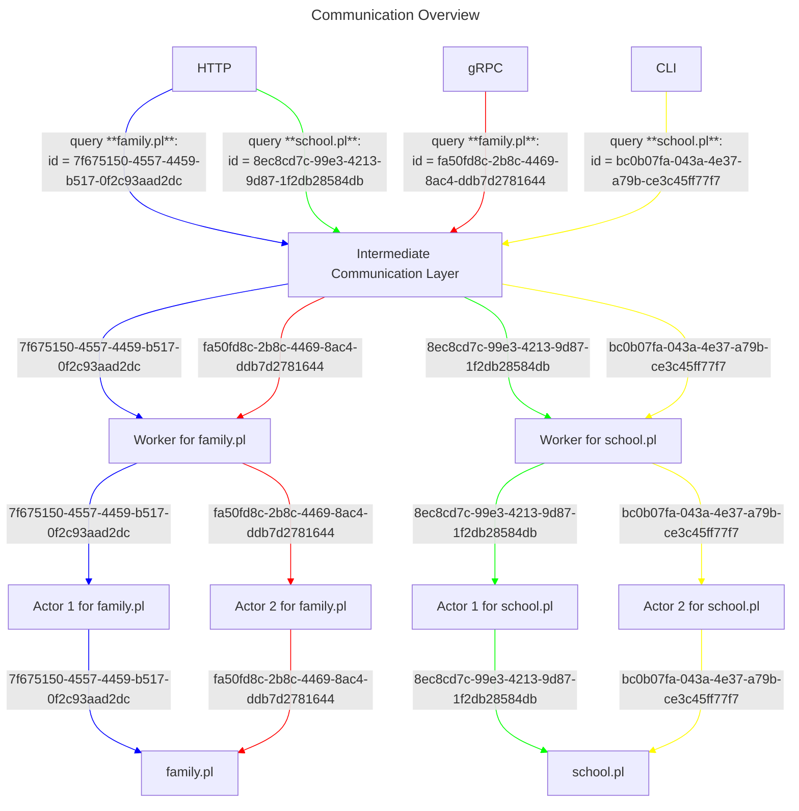
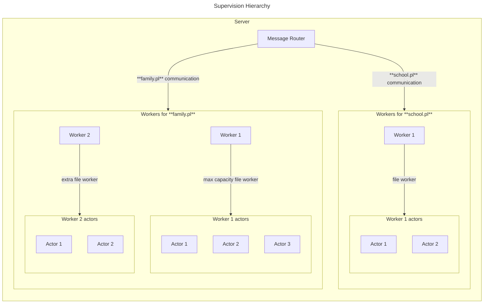

# Architecting a concurrent, multi-reader, file-based Prolog database server

## General ideas

### Application and infrastructural side

The *server* is a host machine (emulated OS, VPS, cloud machine, some Raspberry Pi connected to the internet, ...) which contains a few Prolog files, this abstraction is purely infrastructural.
It runs a *Prolog server*, which is a program that manages *Prolog workers* to load said Prolog files in isolation using `swipl`, by limiting one file per *Prolog worker* (if possible, multiple *Prolog workers* may need to access the same file).
Each *Prolog worker* can then spawn one or more *Prolog actors* to manage concurrent queries, assuming multiple threads can query the same file within a *Prolog worker* at the same time.

### Consumer side

A *consumer* is any entity that connect to the hosting *server* and communicate with the hosted *Prolog server* using one of the supported *communication protocols* (such as REST or gRPC).
It should be able to query specific files (with an optional grace period to load the file first) and receive *messages* one by one.
Messages may fall into the *Prolog Worker* category, which includes solutions to queries, warnings, errors, and so on, or they may fall into the *Prolog Server* category which includes operational semantics and status notifications concerning the server rather than the Prolog processing itself.

## Current architecture and concerns

### What already exists today

There are already a few types that somewhat map onto the aforementioned application and infrastructural concepts:
- `PrologWorker` inside `Prolog.NET.Console` is equivalent to the *Prolog server* (confusing naming)
- `WorkerHost` inside `Prolog.NET.Worker` is equivalent to a *Prolog worker*
- `PrologActor` inside `Prolog.NET.Actor` is equivalent to a *Prolog actor*
- `CliActor` inside `Prolog.NET.Actor` is one communication protocol implementation to handle consumer/server interaction

### Why these abstractions don't work

The `CliActor` was originally created specifically to interface using the CLI for a locally running process, when it should be a completely external wrapper altogether.
Moreover, it is hard-coded to allow up to four processes to open and load files, when in reality this number likely needs to be bumped up or calculated based on the hosting server's resources.
The `WorkerHost` currently spawns a single `PrologActor` to handle all requests as if they come from a single reader.
In a multi-reader setting, actors should be orchestrated to allow for distinct reader queries:
- if two readers each send a query that has multiple answers, and each reader wants to stream the answers one-by-one, two actors will be needed
- for ephemeral queries that yield a single answer and immediately notify no further solutions exist, any idle actor will do
- for this reason, at least one idle actor should exist at all times for each *Prolog worker* to handle ephemeral queries and to enable load balancing
- enabling multiple concurrent streaming queries can be enabled by increasing the number of *Prolog actors* per *Prolog worker* or by increasing the number of *Prolog workers* as well (i.e. process isolation)
- once we understand the performance and throughput profiles of the average server, we can more accurately estimate how to dynamically increase or decrease the number of servers needed to handle API load (assuming each server runs one *Prolog server*)

### Questions to be answered before proceeding

- [x] given the current implementation of `PrologEngine` (inside `Prolog.NET.Swipl`), can multiple threads query the same loaded knowledge base?
- [x] given the current implementation of `PrologEngine`, can multiple processes load the same file?
- [x] given the current implementation of `WorkerHost`, is it possible to refactor it to spawn multiple actors dynamically?

## Desired architecture propositions

### Executable *Prolog server* with protocol management

This approach is analogous to creating something like a [web API using ASP.NET Core](https://learn.microsoft.com/en-us/aspnet/core/tutorials/min-web-api?view=aspnetcore-10.0&tabs=visual-studio) *from scratch* and potentially having to support multiple communication protocols at that (instead of just HTTP).

Benefits:
- standalone build, output is a single daemon or executable
- .NET is cross-platform so it can be shipped to run anywhere
- prepped for additional communication protocol support when needed
- doesn't need to be containerized

Drawbacks:
- need to build protocol and communication from scratch
- the Prolog part might be robust thanks to the actors, but the program itself cannot be an actor
- no native test tools, frameworks or other performance assistance, would need to be written from scratch

### Treat web server as the *Prolog server* and manage file load connection

This approach would simplify the communication and orchestration hierarchy by letting ASP.NET handle all the incoming requests.
However, this would need a huge rework to the way we load and communicate with a Prolog file, because we need to worry about dependency injection.
The ASP.NET application would represent the server, much like a normal web server, but it would no longer be possible to spawn and orchestrate actors on the fly.
If we follow DI principles, there is no custom load balancing, and actors which are spawned to handle long-running queries would quickly eat up resources.

Benefits:
- still cross-platform thanks to .NET
- easy to containerize
- handles HTTP(S) safely and more robustly than we could ever imagine
- has a very mature ecosystem and is easy to set up using something like .NET Aspire

Drawbacks:
- completely renders the idea of using actors useless
- needs a re-architecting of the Prolog file loading layer
- support for other communication protocols is hard to implement
- no obvious way stream consecutive solutions
- instead of designing ASP.NET, this is like designing an Entity Framework connector from scratch

### An alternative approach that would work?

The agreed direction is a **hybrid of proposition 1 and 2**: use ASP.NET Core as the external HTTP/gRPC interface (proposition 2's strength), while preserving Proto.Actor for the internal worker orchestration layer (proposition 1's strength). The actor model is not rendered useless — it is merely scoped correctly.

#### Layer 1 — External interface: `Prolog.NET.Server` (ASP.NET Core app)

Replaces `Prolog.NET.Console` and `CliActor`.

- Kestrel handles inbound HTTP/REST and gRPC from external clients.
- Hosts a Proto.Actor system configured with Proto.Remote (client role only — no named actors of its own).
- Maintains a **worker registry**: maps `filePath → List<WorkerEntry>`, tracks per-worker active query count.
- Routes incoming Prolog queries to an appropriate worker process (load-balancing across workers for the same file).
- Spawns new `Prolog.NET.Worker` processes when all workers for a file are at capacity.
- gRPC server-side streaming for typed clients; Server-Sent Events (SSE) via `POST /api/query` for browser/curl consumers.

#### Layer 2 — Worker processes: `Prolog.NET.Worker` (mostly unchanged)

Each worker is an independent OS process with its own `PrologEngine` (SWI-Prolog singleton).

- `PrologWorker` hosted service: starts Proto.Remote listener, spawns `PrologWorkerActor` named `"prolog"`.
- **`PrologWorkerActor` redesigned**: instead of managing a fixed idle pool, it spawns a new `PrologQueryActor` child for each incoming `OpenQueryMessage` (subject to `PROLOG_ENGINE_THREADS` capacity).
- If all engine threads are in use, responds with `Failed { "No capacity" }` — the server-level router then spawns a new worker process for the same file.
- One-shot messages (`LoadFile`, `Call`, `Query`) handled directly by `PrologWorkerActor` via the injected `PrologEngine`.

#### Layer 3 — Per-query actors: `PrologQueryActor` (new, replaces pooled `PrologActor`)

- Spawned by `PrologWorkerActor` when a query opens; stopped when it ends, errors, or receives `CloseQueryMessage`.
- Holds exactly one open `PrologQuery` for its entire lifetime.
- Handles `NextSolutionMessage` and `CloseQueryMessage` only.
- On `Stopping`: disposes its `PrologQuery`.
- Tracked by `PrologWorkerActor` via `Guid → PID`.

#### Scale-out model

| Bottleneck | Response |
|---|---|
| Too many concurrent queries on one worker | Worker responds `Failed { "No capacity" }`; server spawns another worker process for the same file |
| `PROLOG_ENGINE_THREADS` exhausted | Same — thread count is the capacity signal |
| Worker is idle for too long | Server shuts it down after a grace period (future work) |

## Intended usage

In this section I present two flowcharts that look at how the system should work from two different angles, explaining the high-level assumptions for both perspectives.

### Communication overview: tracking requests

One way to look at how we want the system to be designed is to trace how each request is executed on the system.
In the Mermaid Flowchart below, we see a server that supports three communication protocols: HTTP, gRPC and some CLI semantics.
Assume that communication happens over all three channels *simultaneously*, all trying to talk to the server; perhaps the HTTP calls are external, and the gRPC and CLI calls happen locally for the purpose of debugging or live testing.

All communication methods funnel into the intermediate communication layer, which routes messages appropriately.
Consider the HTTP request with correlation ID `7f675150-4557-4459-b517-0f2c93aad2dc` and the gRPC request with correlation ID `fa50fd8c-2b8c-4469-8ac4-ddb7d2781644`.
These queries both target the `family.pl` file, so the requests get translated to an internal representation and are then routed to the worker for `family.pl`.
The worker spawns an actor for each request, each actor executes the query against the same file, and they stay alive as long as there may be subsequent solutions or until they are halted.
If they happen to be single-solution queries, then each actor may be cleaned up immediately.

The key change in design here is that an actor is a short-lived wrapper around a Prolog thread rather than a fully fledged engine wrapper as per the current design.
It would be the worker that manages the file loading lifecycle, and it would manage actors dynamically.

### Supervision overview: orchestrating workers and actors

Another way to look at how the system should be designed is by the supervision hierarchy and a more deep implementation representation.
In the following Mermaid Flowchart, we abstract away the notion of communication protocols and message translation, and instead look at what the components should look like.

The server represents the whole thing that can route messages, which can target specific Prolog files or knowledge bases.
In this example, there is a set of workers which handle messages for the `family.pl` file and one worker which handles messages for the `school.pl` file.
The key design point here is that multiple workers may exist to effectively load the same file multiple times on separate processes when the throughput of a single worker is insufficient to handle the query load.
This may occur when too many concurrent streaming queries are launched on a single worker, or when you explicitly want to have a dedicated worker to run only ephemeral queries very quickly.

The concurrent streaming queries happen at the actors level, just like in the earlier flowchart.
Each actor wraps a query execution, not the whole engine, and it stays alive only for the time it needs to complete the query or until it is halted.
This makes the Prolog actor a much more lightweight type than it is currently designed to be, but it makes orchestration slightly more complex, because now the worker wraps the Prolog engine and there are two ways to scale out: increase the actors within a worker, or increase the workers.

## Feedback

### Rework completed (2026-03-12)

The hybrid architecture described in "An alternative approach that would work?" has been fully implemented:

- `Prolog.NET.Server` (Layer 1) — ASP.NET Core with REST/SSE and gRPC, `WorkerRegistry` for dynamic worker spawning and capacity routing. Lives at `src/Prolog.NET.Server/`.
- `PrologWorkerActor` (Layer 2) — redesigned to spawn short-lived `PrologQueryActor` children per query, capacity-limited by `PROLOG_ENGINE_THREADS`. No idle pool.
- `PrologQueryActor` (Layer 3) — new short-lived actor holding one `PrologQuery`. Stops itself when query is exhausted, errors, or receives `CloseQueryMessage`.
- Old CLI-based layer (`CliActor`, `CliMessages`, `PrologActor`) removed.

Scale-out works as designed: when a worker is at capacity it returns `Failed { "No capacity" }` and the server spawns a new worker process for the same file.

Outstanding: e2e test project for the server layer, and committing all changes.

Add your own thoughts and concerns here.
