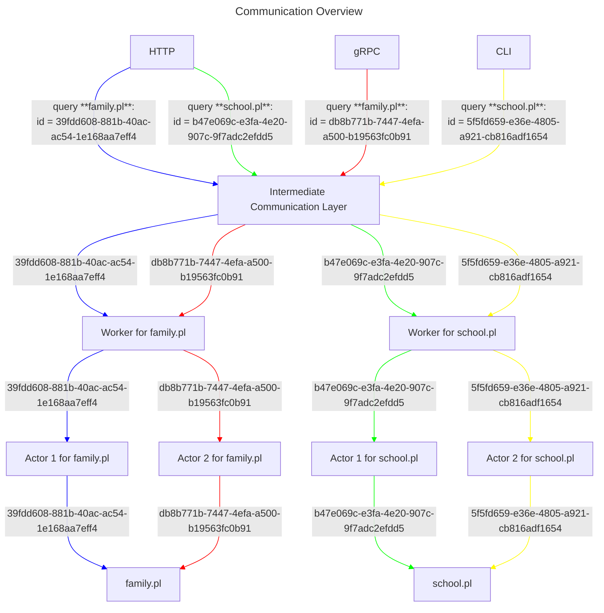

```mermaid
---
title: Communication Overview
---
flowchart TD
  file_family["family.pl"]
  file_school["school.pl"]
  api_http["HTTP"]
  api_grpc["gRPC"]
  api_cli["CLI"]
  intermediate_comms["Intermediate Communication Layer"]
  worker_family["Worker for family.pl"]
  worker_school["Worker for school.pl"]
  actor_family1["Actor 1 for family.pl"]
  actor_family2["Actor 2 for family.pl"]
  actor_school1["Actor 1 for school.pl"]
  actor_school2["Actor 2 for school.pl"]

  api_http --->|"query **family.pl**:
id = 39fdd608-881b-40ac-ac54-1e168aa7eff4"| intermediate_comms
  api_http --->|"query **school.pl**:
id = b47e069c-e3fa-4e20-907c-9f7adc2efdd5"| intermediate_comms
  api_grpc --->|"query **family.pl**:
id = db8b771b-7447-4efa-a500-b19563fc0b91"| intermediate_comms
  api_cli --->|"query **school.pl**:
id = 5f5fd659-e36e-4805-a921-cb816adf1654"| intermediate_comms
  intermediate_comms --->|"39fdd608-881b-40ac-ac54-1e168aa7eff4"| worker_family
  intermediate_comms --->|"db8b771b-7447-4efa-a500-b19563fc0b91"| worker_family
  intermediate_comms --->|"b47e069c-e3fa-4e20-907c-9f7adc2efdd5"| worker_school
  intermediate_comms --->|"5f5fd659-e36e-4805-a921-cb816adf1654"| worker_school
  worker_family --->|"39fdd608-881b-40ac-ac54-1e168aa7eff4"| actor_family1
  worker_family --->|"db8b771b-7447-4efa-a500-b19563fc0b91"| actor_family2
  worker_school --->|"b47e069c-e3fa-4e20-907c-9f7adc2efdd5"| actor_school1
  worker_school --->|"5f5fd659-e36e-4805-a921-cb816adf1654"| actor_school2
  actor_family1 --->|"39fdd608-881b-40ac-ac54-1e168aa7eff4"| file_family
  actor_family2 --->|"db8b771b-7447-4efa-a500-b19563fc0b91"| file_family
  actor_school1 --->|"b47e069c-e3fa-4e20-907c-9f7adc2efdd5"| file_school
  actor_school2 --->|"5f5fd659-e36e-4805-a921-cb816adf1654"| file_school

  linkStyle 0,4,8,12 stroke:#0000ff
  linkStyle 1,6,10,14 stroke:#00ff00
  linkStyle 2,5,9,13 stroke:#ff0000
  linkStyle 3,7,11,15 stroke:#fffb00

```