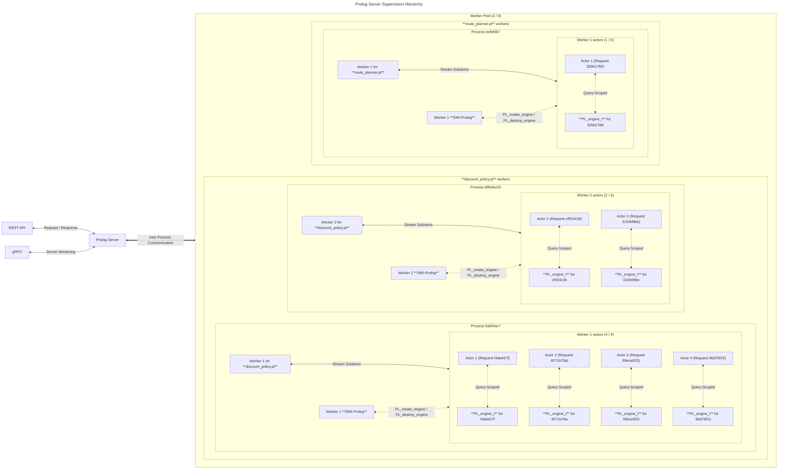

```mermaid
---
title: Prolog Server Supervision Hierarchy
---
flowchart LR
  restapi_1d0cb618-11d3-4363-a46a-c3f3a603b861["REST API"]
  grpc_1e48501a-d183-49f6-b35f-c7b1927fcb3a["gRPC"]
  prolog_server["Prolog Server"]

  subgraph worker_pool ["Worker Pool (3 / 8)"]
    direction LR

    subgraph workers_discount_policy_pl ["**discount_policy.pl** workers"]
      direction LR

      subgraph process_6af04ac7-01b4-493f-885e-f14536eee1e5 ["Process 6af04ac7"]
        direction LR
        worker_6af04ac7-01b4-493f-885e-f14536eee1e5_1["Worker 1 for **discount_policy.pl**"]
        worker_6af04ac7-01b4-493f-885e-f14536eee1e5_1_swipl["Worker 1 **SWI-Prolog**"]

        subgraph worker_6af04ac7-01b4-493f-885e-f14536eee1e5_1_actorpool ["Worker 1 actors (4 / 4)"]
          worker_6af04ac7-01b4-493f-885e-f14536eee1e5_1_actor1["Actor 1 (Request f4abe57f)"]
          worker_6af04ac7-01b4-493f-885e-f14536eee1e5_1_actor1_engine["**PL_engine_t** for f4abe57f"]
          worker_6af04ac7-01b4-493f-885e-f14536eee1e5_1_actor2["Actor 2 (Request 4071b76a)"]
          worker_6af04ac7-01b4-493f-885e-f14536eee1e5_1_actor2_engine["**PL_engine_t** for 4071b76a"]
          worker_6af04ac7-01b4-493f-885e-f14536eee1e5_1_actor3["Actor 3 (Request 89ece625)"]
          worker_6af04ac7-01b4-493f-885e-f14536eee1e5_1_actor3_engine["**PL_engine_t** for 89ece625"]
          worker_6af04ac7-01b4-493f-885e-f14536eee1e5_1_actor4["Actor 4 (Request 96d76f15)"]
          worker_6af04ac7-01b4-493f-885e-f14536eee1e5_1_actor4_engine["**PL_engine_t** for 96d76f15"]

          worker_6af04ac7-01b4-493f-885e-f14536eee1e5_1_actor1 <-.->|"Query-Scoped"| worker_6af04ac7-01b4-493f-885e-f14536eee1e5_1_actor1_engine
          worker_6af04ac7-01b4-493f-885e-f14536eee1e5_1_actor2 <-.->|"Query-Scoped"| worker_6af04ac7-01b4-493f-885e-f14536eee1e5_1_actor2_engine
          worker_6af04ac7-01b4-493f-885e-f14536eee1e5_1_actor3 <-.->|"Query-Scoped"| worker_6af04ac7-01b4-493f-885e-f14536eee1e5_1_actor3_engine
          worker_6af04ac7-01b4-493f-885e-f14536eee1e5_1_actor4 <-.->|"Query-Scoped"| worker_6af04ac7-01b4-493f-885e-f14536eee1e5_1_actor4_engine
        end

        worker_6af04ac7-01b4-493f-885e-f14536eee1e5_1 <--->|"Stream Solutions"| worker_6af04ac7-01b4-493f-885e-f14536eee1e5_1_actorpool
        worker_6af04ac7-01b4-493f-885e-f14536eee1e5_1_swipl <-.->|"PL_create_engine / PL_destroy_engine"| worker_6af04ac7-01b4-493f-885e-f14536eee1e5_1_actorpool
      end
      subgraph process_895dee26-6b86-46d9-b87d-52bd7762e4f6 ["Process 895dee26"]
        direction LR
        worker_895dee26-6b86-46d9-b87d-52bd7762e4f6_2["Worker 2 for **discount_policy.pl**"]
        worker_895dee26-6b86-46d9-b87d-52bd7762e4f6_2_swipl["Worker 2 **SWI-Prolog**"]

        subgraph worker_895dee26-6b86-46d9-b87d-52bd7762e4f6_2_actorpool ["Worker 2 actors (2 / 4)"]
          worker_895dee26-6b86-46d9-b87d-52bd7762e4f6_2_actor1["Actor 1 (Request cf924c35)"]
          worker_895dee26-6b86-46d9-b87d-52bd7762e4f6_2_actor1_engine["**PL_engine_t** for cf924c35"]
          worker_895dee26-6b86-46d9-b87d-52bd7762e4f6_2_actor2["Actor 2 (Request 3159d9be)"]
          worker_895dee26-6b86-46d9-b87d-52bd7762e4f6_2_actor2_engine["**PL_engine_t** for 3159d9be"]

          worker_895dee26-6b86-46d9-b87d-52bd7762e4f6_2_actor1 <-.->|"Query-Scoped"| worker_895dee26-6b86-46d9-b87d-52bd7762e4f6_2_actor1_engine
          worker_895dee26-6b86-46d9-b87d-52bd7762e4f6_2_actor2 <-.->|"Query-Scoped"| worker_895dee26-6b86-46d9-b87d-52bd7762e4f6_2_actor2_engine
        end

        worker_895dee26-6b86-46d9-b87d-52bd7762e4f6_2 <--->|"Stream Solutions"| worker_895dee26-6b86-46d9-b87d-52bd7762e4f6_2_actorpool
        worker_895dee26-6b86-46d9-b87d-52bd7762e4f6_2_swipl <-.->|"PL_create_engine / PL_destroy_engine"| worker_895dee26-6b86-46d9-b87d-52bd7762e4f6_2_actorpool
      end
    end
    subgraph workers_route_planner_pl ["**route_planner.pl** workers"]
      direction LR

      subgraph process_eefef367-bed7-49c8-a8b9-083042c6c9b0 ["Process eefef367"]
        direction LR
        worker_eefef367-bed7-49c8-a8b9-083042c6c9b0_1["Worker 1 for **route_planner.pl**"]
        worker_eefef367-bed7-49c8-a8b9-083042c6c9b0_1_swipl["Worker 1 **SWI-Prolog**"]

        subgraph worker_eefef367-bed7-49c8-a8b9-083042c6c9b0_1_actorpool ["Worker 1 actors (1 / 6)"]
          worker_eefef367-bed7-49c8-a8b9-083042c6c9b0_1_actor1["Actor 1 (Request 32bb1786)"]
          worker_eefef367-bed7-49c8-a8b9-083042c6c9b0_1_actor1_engine["**PL_engine_t** for 32bb1786"]

          worker_eefef367-bed7-49c8-a8b9-083042c6c9b0_1_actor1 <-.->|"Query-Scoped"| worker_eefef367-bed7-49c8-a8b9-083042c6c9b0_1_actor1_engine
        end

        worker_eefef367-bed7-49c8-a8b9-083042c6c9b0_1 <--->|"Stream Solutions"| worker_eefef367-bed7-49c8-a8b9-083042c6c9b0_1_actorpool
        worker_eefef367-bed7-49c8-a8b9-083042c6c9b0_1_swipl <-.->|"PL_create_engine / PL_destroy_engine"| worker_eefef367-bed7-49c8-a8b9-083042c6c9b0_1_actorpool
      end
    end
  end

  restapi_1d0cb618-11d3-4363-a46a-c3f3a603b861 <--->|"Request / Response"| prolog_server
  grpc_1e48501a-d183-49f6-b35f-c7b1927fcb3a <--->|"Server Streaming"| prolog_server
  prolog_server <===>|"Inter-Process Communication"| worker_pool

```