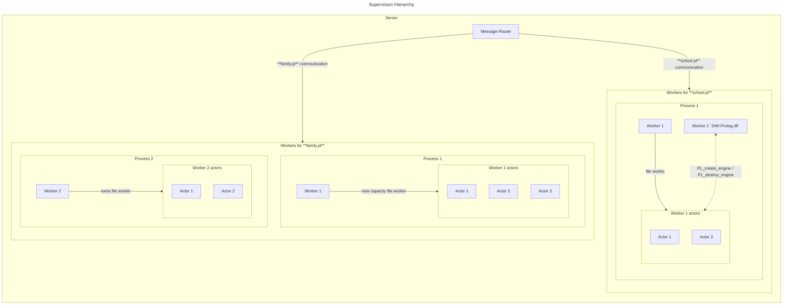

```mermaid
---
title: Supervision Hierarchy
---
flowchart TD

  subgraph server ["Server"]
    direction TB
    router["Message Router"]

    subgraph workers_family ["Workers for **family.pl**"]
      direction TB

      subgraph worker_family1_process1 ["Process 1"]
        worker_family1["Worker 1"]

        subgraph worker_family1_actors ["Worker 1 actors"]
          direction TB
          worker_family1_actor1["Actor 1"]
          worker_family1_actor2["Actor 2"]
          worker_family1_actor3["Actor 3"]
        end

        worker_family1 --->|"max capacity file worker"| worker_family1_actors
      end
      subgraph worker_family1_process2 ["Process 2"]
        worker_family2["Worker 2"]

        subgraph worker_family2_actors ["Worker 2 actors"]
          direction TB
          worker_family2_actor1["Actor 1"]
          worker_family2_actor2["Actor 2"]
        end

        worker_family2 --->|"extra file worker"| worker_family2_actors
      end
    end
    subgraph workers_school ["Workers for **school.pl**"]
      direction TB

      subgraph worker_school1_process1 ["Process 1"]
        direction TB
        worker_school1["Worker 1"]
        worker_school1_engine["Worker 1 `SWI-Prolog.dll`"]

        subgraph worker_school1_actors ["Worker 1 actors"]
          direction TB
          worker_school1_actor1["Actor 1"]
          worker_school1_actor2["Actor 2"]
        end

        worker_school1 --->|"file worker"| worker_school1_actors
        worker_school1_engine <-..->|"PL_create_engine / PL_destroy_engine"| worker_school1_actors
      end
    end

    router --->|"**family.pl** communication"| workers_family
    router --->|"**school.pl** communication"| workers_school
  end

```